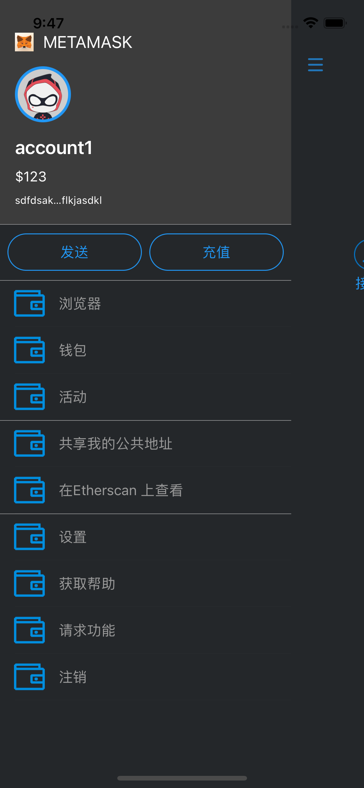
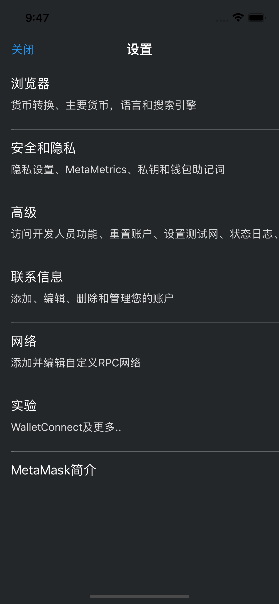
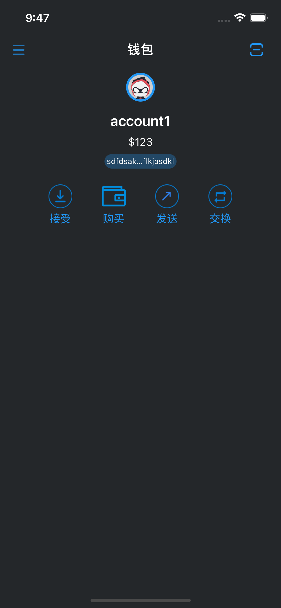
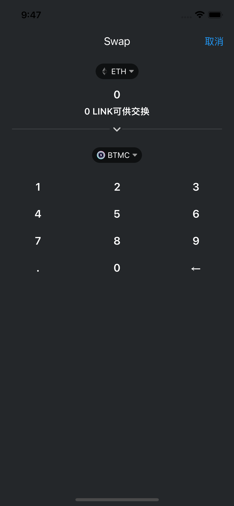
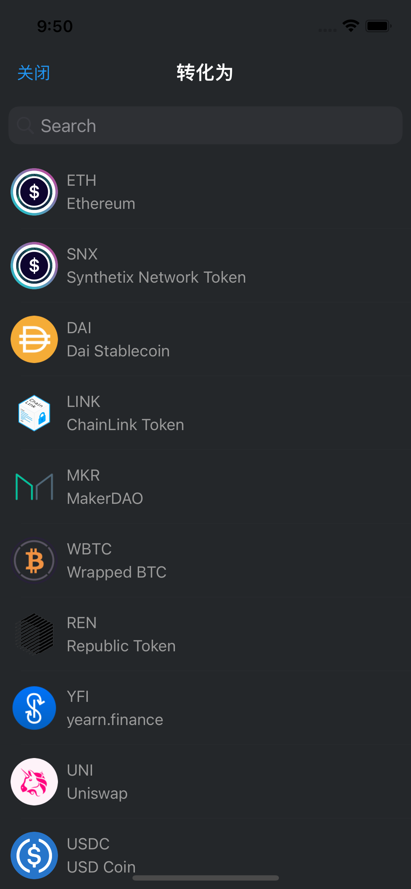

#  HomeTask
  主要用VIPER架构，由于有些界面比较简单，所以数据源和点击处理都放在present中处理; 布局采用AutoLayout，由于test没有使用SnapKit。       
   使用的库： 
       
     1. SideMenu :侧边栏  
     2. HandyJSON: 解析json转model   
     3. Kingfisher：图片下载第三方库
## 一、左边侧边栏
### 类：
    - 控制器：GLLeftSideViewController
    - 侧边栏顶部view: GLLeftSideHeaderView
    - cell: GLLeftSideViewCell和GLLeftSideSendAndPayCell
    - model：GLLeftViewModel和GLAccountModel
    - Presenter：GLLeftSideViewPresenter 数据处理和点击处理
列表点击事件，目前只处理了点击"设置"列表

## 二、设置界面
### 类：GLSettingViewController
    - 控制器：GLSettingViewController
    - view：GLLeftSideHeaderView
    - cell: GLSettingCell
    - model：GLSettingModel
    - GLLeftSideViewPresenter 数据处理和点击处理
1. 通过present设置列表数据，点击事件在present处理，新增和删除内容比较方便；
2. model中的type标识点击哪个列表

## 三、钱包主界面
### 类：
    - 控制器：MainViewController
    - 顶部GLMainHeaderView
    - 用户数据: GLUserModel单列
    - model：GLAccountModel
 只做了简单展示，所以没有全部实现当前所有界面，点击“交换”按钮进入下一级界面。
 
 
## 四、币交换界面
### 类：
    - 控制器：GLSwapViewController
    - 顶部界面：GLSwapHeaderView
    - 数字输入界面：GLSwapNumberInputView
   1. 界面分为二部分，一部分是上面当前币和选择交换的币，另外是选择数字输入和删除
   2. 输入数字会更新当前交换的数量label
   3. 点击更交换的币会进入搜索界面
   
   
## 五、交换搜索界面
### 类：
    - 控制器：GLSwapSearchViewController
    - cell：GLSwapSearchCell
这里只简单做了模拟加载抓包获取的json网数据，列表中的图片是网络下载。由于时间关系没有做成半窗。

## 六、币集合
 1. 币集合的抓包数据：coinsConfig.json
 2. 币model：GLCoinModel

## 七、图片资源获取方式
  - 1. iphone下载metaMask后，通过Apple Configurator获取ipa，然后获取资源
  - 2. 解压安卓安装包获取资
  - 3. 图片资源有些通过tintColor方式把其他颜色改成蓝色   
